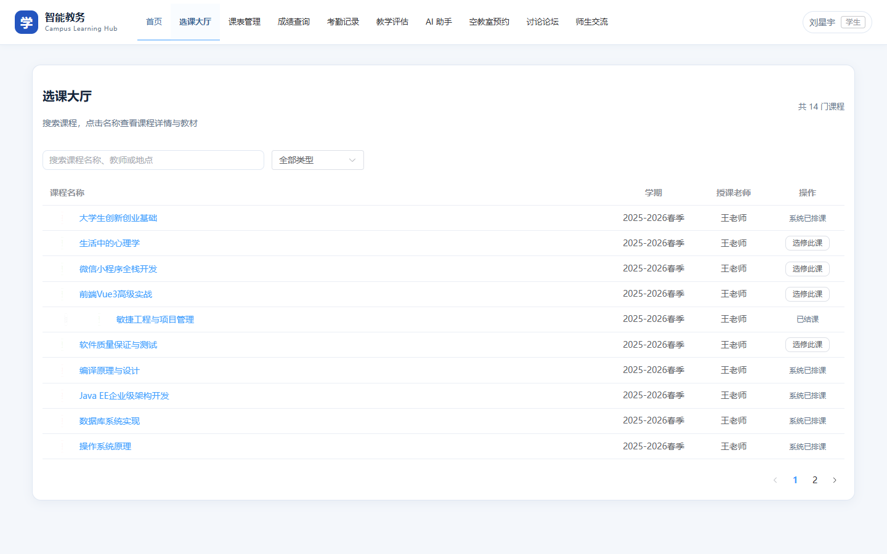
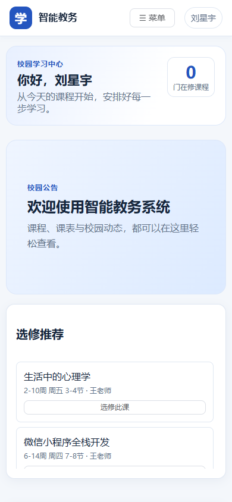

# 智能教务系统

一个前后端分离的校园教务管理系统，包含选课、排课、成绩、考勤、教学评估、空教室预约、论坛交流、师生私信以及基于大模型的 AI 助手等功能。

## 界面预览

桌面端首页与选课大厅：




移动端首页与选课大厅：

 

以上截图使用仓库内的演示账号和数据，展示响应式布局、课程搜索与移动端课程卡片。

## 体验与性能改进

- 重新设计首页、登录页与导航；手机端使用抽屉菜单和课程卡片，弹窗也适配窄屏。
- 选课大厅新增搜索、类型筛选、分页、已选状态和退课确认；课程表与消息发送的操作反馈更清晰。
- 按需注册实际使用的 Element Plus 组件；生产构建的 JavaScript gzip 体积从约 354 KB 降至约 233 KB。
- 消息轮询降频并在后台标签页暂停；课程、成绩和论坛评论改为批量查询，减少数据库往返。
- 增加令牌验证、角色与账号归属检查、密码哈希和敏感字段保护。

## 技术栈

- 前端：Vue 3 + Vite + Element Plus + Axios
- 后端：Spring Boot 3 + MyBatis-Plus + MySQL 8 + JWT
- AI：Spring AI + DeepSeek（兼容 OpenAI 接口）

## 目录结构

```
├── course-frontend/        # 前端工程（Vue 3 + Vite）
├── course-system/          # 后端工程（Spring Boot 3 + Maven）
│   └── course-system/      # Maven 实际工程目录
└── sql/                    # 数据库脚本
    ├── schema.sql          # 表结构
    └── seed.sql            # 演示数据（可选）
```

## 运行环境

- JDK 17+
- Maven 3.8+
- Node.js 18+
- MySQL 8.0+

## 快速启动

### 1. 初始化数据库

```bash
mysql -uroot -p -e "CREATE DATABASE IF NOT EXISTS courserec_db DEFAULT CHARSET utf8mb4;"
mysql -uroot -p courserec_db < sql/schema.sql
mysql -uroot -p courserec_db < sql/seed.sql   # 可选，仅首次需要演示数据
```

### 2. 配置后端

后端敏感配置（数据库密码、AI Key）不会提交到仓库。首次运行请复制示例配置并填写：

```bash
cd course-system/course-system
cp application.yml.example src/main/resources/application.yml
```

然后编辑 `src/main/resources/application.yml`，填写你的 MySQL 密码和 DeepSeek API Key。

### 3. 启动后端

```bash
cd course-system/course-system
mvn spring-boot:run
```

后端默认运行在 `http://localhost:8080`。

### 4. 启动前端

```bash
cd course-frontend
npm install
npm run dev
```

前端默认运行在 `http://localhost:5173`。若后端地址不同，可复制 `.env.example` 为 `.env` 并修改 `VITE_API_BASE_URL`。

## 默认演示账号

执行 `sql/seed.sql` 后会创建以下账号（仅演示用途）：

| 角色 | 账号 | 密码 |
| --- | --- | --- |
| 管理员 | admin | admin123 |
| 教师 | teacher01 | 123456 |
| 学生 | student01 | 123456 |

## 安全说明

- 数据库密码、DeepSeek API Key 等敏感信息存放在本地 `application.yml` 中，该文件已加入 `.gitignore`，请勿提交。
- JWT 签名密钥可通过环境变量 `JWT_SECRET` 覆盖，生产环境请使用强随机值。
- 未设置 `JWT_SECRET` 时，应用会在每次启动时随机生成签名密钥；重启后需要重新登录。部署时应设置稳定、足够强的密钥。
- 新注册和重置的密码使用 BCrypt 存储；旧版演示账号的明文密码会在首次成功登录后自动升级。新密码至少 8 位。
- 除登录、注册和演示用找回密码外，接口需要有效 JWT；管理操作限制为管理员，关键师生操作会校验角色与账号归属。
- 演示用找回密码仍仅凭账号和预留联系方式验证，不适合正式部署。正式使用前需接入一次性验证码、限流和审计。

## 验证

```bash
cd course-frontend && npm run build
cd ../course-system/course-system && mvn test
```

## 主要功能

- 登录 / 注册 / 找回密码（JWT 鉴权）
- 学生：选课大厅、课表、退课、成绩、考勤、教学评估
- 教师：发布课程、考勤录入、成绩录入、评教报告
- 管理员：账号管理、全局课程、教室管理、首页轮播图
- 通用：空教室查询与预约、讨论论坛、师生私信
- AI 助手：基于 DeepSeek 的课程查询与教务问答
